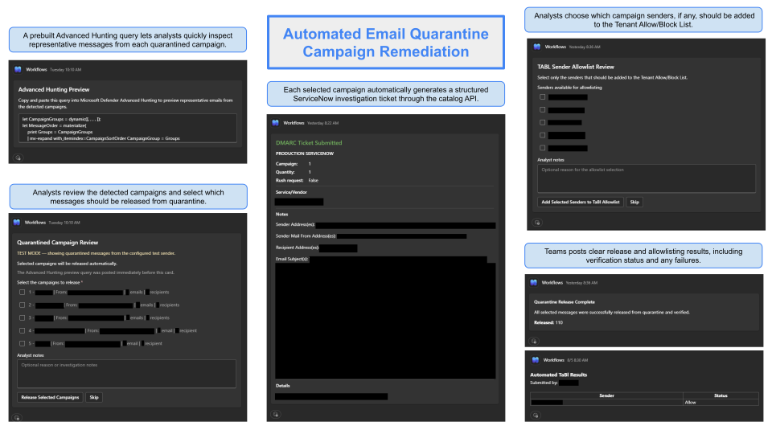

# Automated Email Quarantine Campaign Remediation


![Azure Logic Apps](https://img.shields.io/badge/%20%20Azure%20Logic%20Apps-0078D4?style=flat&logo=data:image/svg%2bxml;base64,PHN2ZyB4bWxucz0iaHR0cDovL3d3dy53My5vcmcvMjAwMC9zdmciIHZpZXdCb3g9IjAgMCAxOCAxOCI+PHBhdGggZD0iTTEzLjg1MSw5LjA0N0gxMC45MzlBMS41MTgsMS41MTgsMCwwLDEsOS40MjEsNy41Mjl2LTMuMkg4LjU3OXYzLjJBMS41MTgsMS41MTgsMCwwLDEsNy4wNjEsOS4wNDdINC4xNDlhMS4yLDEuMiwwLDAsMC0xLjIsMS4ydjIuMzM4aC44NDFWMTAuMjQ0YS4zNTUuMzU1LDAsMCwxLC4zNTYtLjM1NUg3LjA2MUEyLjM1MywyLjM1MywwLDAsMCw4LjgsOS4xMjVhLjI3OC4yNzgsMCwwLDEsLjQwOCwwLDIuMzUzLDIuMzUzLDAsMCwwLDEuNzM1Ljc2NGgyLjkxNmEuMzU4LjM1NCwwLDAsMSwuMzU1LjM1NXYyLjMzOGguODQxVjEwLjI0NEExLjIsMS4yLDAsMCwwLDEzLjg1MSw5LjA0N1oiIGZpbGw9IiNmZmZmZmYiLz48cmVjdCB4PSI1LjYyNiIgeT0iLTAuMDIiIHdpZHRoPSI2Ljc0NyIgaGVpZ2h0PSI2Ljc0NyIgcng9IjAuNjA0IiBmaWxsPSIjZmZmZmZmIi8+PHJlY3QgeT0iMTEuMjczIiB3aWR0aD0iNi43NDciIGhlaWdodD0iNi43NDciIHJ4PSIwLjYwNCIgZmlsbD0iI2ZmZmZmZiIvPjxyZWN0IHg9IjExLjI1MyIgeT0iMTEuMjczIiB3aWR0aD0iNi43NDciIGhlaWdodD0iNi43NDciIHJ4PSIwLjYwNCIgdHJhbnNmb3JtPSJ0cmFuc2xhdGUoMjkuMjczIDAuMDIpIHJvdGF0ZSg5MCkiIGZpbGw9IiNmZmZmZmYiLz48L3N2Zz4=)


> **Author:** Gabriel Wolf


> [!NOTE]
> These templates are provided as anonymized reference implementations, not one-click marketplace-style deployments. 
> The goal of this repository is to share the architecture, workflow logic, and implementation patterns behind the automation—not to provide a guaranteed plug-and-play deployment for every environment.

---

## Overview

Organizations that enforce DMARC may quarantine legitimate services that send mail using an internal domain without aligning their authentication correctly. Reviewing and releasing those messages individually is slow, and broad allowlisting without analyst review creates unnecessary risk.

This workflow separates detection, review, release, allowlisting, and ticket creation into controlled stages:

- Microsoft Defender email telemetry identifies candidate messages.
- KQL excludes messages that are no longer quarantined or were already released.
- Related messages are grouped into analyst-friendly campaigns.
- Microsoft Teams presents the campaigns as selectable checkboxes.
- Each selected campaign generates a ServiceNow investigation request.
- Release can run automatically through Azure Automation or produce a manual PowerShell command.
- A separate Teams card allows analysts to choose which senders, if any, should be added to the Tenant Allow/Block List.




---

## Current Workflow

### 1. Run on a recurring schedule

The Logic App uses a recurrence trigger configured to run every two hours in Central Time. Detection timing is controlled independently by the KQL parameters, so the recurrence interval does not need to equal the full campaign correlation window.

```text
Frequency: Hour
Interval: 2
Time zone: Central Standard Time
```

`LookbackPeriod` determines how recently a campaign must have received a message to appear in the current review. `CampaignTimeWindow` determines how much historical data can be used to build and correlate that campaign.

### 2. Select the production or test query

`TestMode` controls which KQL query is executed.

Production mode searches for inbound messages that:

- Are associated with the configured sender domain
- Failed DMARC
- Are currently quarantined
- Have not already been released
- Are not classified as phishing or malware
- Have usable Internet and Network Message IDs
- Meet the configured minimum email count

Test mode uses a configured sender address and a lower threshold so the workflow can be exercised without waiting for a production spoofing campaign.

<details>
<summary><strong>View production safety filters</strong></summary>

> The production query builds a released-message set from both `EmailPostDeliveryEvents` and the latest state in `EmailEvents`. A left-anti join removes those Network Message IDs before any campaign grouping occurs.
>
> ```kusto
> | join kind=leftanti ReleasedNetworkMessageIds on
>     $left.NetworkMessageId == $right.ReleasedNetworkMessageId
> ```
>
> It then confirms the latest delivery state and removes malicious verdicts before the messages enter the campaign graph.
>
> ```kusto
> | where CurrentDeliveryLocation =~ "Quarantine"
> | where LatestDeliveryAction !~ "Quarantine release"
> | where ThreatTypes !has "Phish"
> | where ThreatTypes !has "Malware"
> | where DMARC !~ "pass"
> ```

</details>

### 3. Group related messages into campaigns

The production query normalizes subjects and sender addresses, then creates graph nodes for:

- Normalized subject
- Microsoft `EmailClusterId`
- Normalized sender address

Weakly connected graph components allow messages to form one campaign when they share a subject, cluster, or sender relationship. These relationships are transitive: if one subject connects to a cluster and that cluster connects to another subject, both subjects become part of the same campaign.

<details>
<summary><strong>View campaign graph construction</strong></summary>

> ```kusto
> let CampaignEdges =
>     union
>         (
>             BaseEvents
>             | project SourceNode = SubjectNode, TargetNode = ClusterNode
>         ),
>         (
>             BaseEvents
>             | project SourceNode = SubjectNode, TargetNode = SenderNode
>         )
>     | distinct SourceNode, TargetNode;
>
> let SubjectComponentMap =
>     CampaignEdges
>     | make-graph SourceNode --> TargetNode with_node_id=NodeId
>     | graph-mark-components kind=weak with_component_id=CampaignComponent
>     | graph-to-table nodes;
> ```

</details>

The final campaign object retains the data required by downstream actions:

- Campaign key and display number
- Subject previews and complete subject collection
- Sender and envelope sender collections
- Recipient collection
- Internet Message IDs used for release
- Network Message IDs used for Defender preview
- Total message and recipient counts
- First-seen and last-seen timestamps
- DMARC results

### 4. Create a concise Advanced Hunting preview

Before the approval card is posted, the workflow sends a Defender Advanced Hunting query to Teams. The query provides representative messages for the detected campaigns so an analyst can inspect the email entities and open the clickable Network Message IDs in Defender.

The preview is intentionally separate from the interactive card. This prevents a large KQL string from pushing the Adaptive Card beyond the Teams payload limit.

The preview query returns:

- Campaign number
- Timestamp
- Subject
- Sender address
- Recipient address
- Network Message ID

### 5. Present campaign choices in Microsoft Teams

The campaign card shows numbered checkboxes with the most useful campaign attributes:

```text
1 - [subject previews] | From: sender@example.com | 42 emails | 18 recipients
```

The analyst can:

- Select one or more campaigns
- Enter investigation notes
- Submit the selected campaigns
- Skip the review without selecting anything

The checkbox value contains the campaign key rather than the visible text. After submission, the Logic App matches those keys back to the complete campaign objects in `CampaignResults`.

### 6. Expand the selected campaign objects

For every selected campaign, the Logic App expands and collects:

- Internet Message IDs
- Sender addresses
- Sender mail-from addresses
- Recipient addresses
- Subject variants
- Campaign counts and identifiers

Internet Message IDs and sender addresses are deduplicated before release or allowlist remediation. The workflow keeps the complete campaign object available so future actions can reuse the same source data without rerunning KQL.

### 7. Resolve sender departments with Microsoft Graph

Each selected sender is searched in Microsoft Entra ID. The query attempts to match:

- `mail`
- `userPrincipalName`
- `onPremisesSamAccountName`

The SAM account lookup uses the local part of the email address. This supports hybrid identities whose visible sender address differs from their Entra user principal name.

The returned `department` values are deduplicated and joined to create the ServiceNow `vendor` value. When no matching department is available, the workflow uses `Unknown department`.

### 8. Create one ServiceNow request per selected campaign

The workflow submits one ServiceNow catalog request for each selected campaign. Test and production endpoints are controlled independently with `ServiceNowTestMode`.

The request body uses the following field mapping:

| ServiceNow field | Workflow value |
| --- | --- |
| `sysparm_quantity` | `1` |
| `vendor` | Deduplicated Entra department value or `Unknown department` |
| `details` | Configured `DetailMessage` parameter |
| `notes` | Sender, mail-from sender, recipients, subjects, and optional analyst notes |
| `rush_request` | `false` |

<details>
<summary><strong>View submitted ServiceNow body structure</strong></summary>

> ```json
> {
>   "sysparm_quantity": "1",
>   "variables": {
>     "vendor": "Example Department",
>     "details": "Submitted by Email Quarantine Campaign Remediation Logic App",
>     "notes": "Sender Address(es): sender@example.com\n\n\nRecipient Address(es): recipient@example.com",
>     "rush_request": "false"
>   }
> }
> ```
>
> The production Logic App also includes sender mail-from addresses, subjects, and the analyst's notes in the `notes` field.

</details>

The ServiceNow password is retrieved from Azure Key Vault at runtime. It is not stored in the ARM template.

### 9. Release selected quarantine messages

`AutomatedRelease` controls the release path.

#### Automated release

The Logic App starts `Release-QuarantineCampaign.ps1` in Azure Automation. The runbook:

1. Parses the selected Internet Message IDs.
2. Connects to Exchange Online using an application certificate.
3. Resolves each Internet Message ID with `Get-QuarantineMessage`.
4. Releases every matching quarantine object with `Release-QuarantineMessage`.
5. Polls `ReleaseStatus` to verify the result.
6. Returns one structured JSON result covering success, partial success, or failure.

The Logic App parses that JSON and posts either a success card or an incomplete-release card containing the failed message IDs.

#### Manual release

When automated release is disabled, the Logic App generates a PowerShell command that uses `Connect-IPPSSession`, resolves each Internet Message ID, and releases the matching quarantine messages. The command is posted to Teams for an authorized analyst to copy and run.

### 10. Review optional TABL sender remediation

When `AllowRemediations` is enabled, a second Adaptive Card lists the unique sender addresses from the selected campaigns. This is a separate approval decision from quarantine release.

The analyst can:

- Select specific senders for allowlisting
- Enter optional allowlist notes
- Skip sender remediation entirely

Only selected sender values are sent to Azure Automation.

### 11. Add or check Tenant Allow/Block List entries

`Manage-TenantAllowList.ps1` supports two actions:

- `Check` returns `Allow`, `Block`, or `Unknown` without changing the entry.
- `Add` creates a new sender allow entry or updates the expiration and notes for an existing allow entry.

The runbook refuses to overwrite an existing block entry. After an add or update, it polls the exact sender entry until the allow state is visible or the verification window expires.

The Logic App posts an HTML summary table containing the sender and returned status. The submitter's Teams display name or email address is also recorded in the result message and can be passed into the TABL notes.

---

## Project Files

### [`azuredeploy.json`](logic-app/azuredeploy.json)

Sanitized ARM template for the Consumption Logic App.

It includes:

- User-assigned managed identity attachment
- Two-hour recurrence trigger
- Production and test KQL
- Campaign construction and selection logic
- Defender Advanced Hunting preview generation
- Teams approval cards and result messages
- ServiceNow ticket submission
- Azure Automation release and TABL jobs
- Manual release-command generation
- Key Vault secret retrieval

The template references existing API connections and supporting resources. It does not create the Azure Automation account, Key Vault, app registrations, managed identity, Teams team/channel, Log Analytics workspace, or ServiceNow catalog item.

### [`Release-QuarantineCampaign.ps1`](runbooks/Release-QuarantineCampaign.ps1)

Azure Automation runbook for releasing and verifying quarantine messages.

It accepts one or more Internet Message IDs separated by `|||`, supports `release` and `check` actions, and returns compressed JSON for the Logic App.

### [`Manage-TenantAllowList.ps1`](runbooks/Manage-TenantAllowList.ps1)

Azure Automation runbook for checking, creating, and updating sender allow entries in the Microsoft Tenant Allow/Block List.

It validates sender syntax, protects existing block entries, supports configurable expiration, and verifies the final allow state.

---

## Requirements

<details>
<summary><strong>View Requirements</strong></summary>

### Microsoft security data

- Microsoft Defender for Office 365 email telemetry
- Access to `EmailEvents`
- Access to `EmailPostDeliveryEvents`
- A Microsoft Sentinel or Log Analytics workspace containing the required Defender tables
- KQL graph operators supported in the selected query environment

### Azure resources

- Azure Logic Apps Consumption workflow
- Azure Automation account
- Azure Key Vault
- User-assigned managed identity
- Log Analytics workspace
- API connections for Azure Monitor Logs, Microsoft Teams, Azure Automation, and Key Vault

### Microsoft 365 services

- Exchange Online PowerShell
- Microsoft Defender quarantine
- Microsoft Teams
- Microsoft Graph
- Tenant Allow/Block List access

### External service

- ServiceNow catalog item API endpoint
- Basic-auth service account authorized to order the configured catalog item

</details>

---

## Required Permissions

### Logic App managed identity

The user-assigned managed identity requires only the Azure permissions needed by the actions it performs.

| Scope | Example role | Purpose |
| --- | --- | --- |
| Azure Key Vault | Key Vault Secrets User | Read the ServiceNow and Graph secrets |
| Azure Automation account | Automation Job Operator | Start runbook jobs and read job status/output |
| Log Analytics workspace | Log Analytics Reader, when required by the connection design | Execute the campaign query |

Use the narrowest resource scope supported by the environment instead of assigning these roles at subscription scope.

### Exchange Online automation application

The app registration used by the runbooks requires:

- Office 365 Exchange Online application permission `Exchange.ManageAsApp`
- Tenant-wide admin consent
- An appropriate Exchange Online or Microsoft Entra administrative role that permits the quarantine and Tenant Allow/Block List cmdlets used by the runbooks

The exact RBAC assignment should be restricted to the required cmdlets and validated in the target tenant. Avoid assigning Global Administrator solely for runbook execution.

### Microsoft Graph lookup application

The app registration used for department lookup requires:

- Microsoft Graph application permission `User.Read.All`, or another approved directory-read permission that exposes the required user attributes
- Tenant-wide admin consent

The workflow reads only:

- `department`
- `displayName`
- `mail`
- `userPrincipalName`
- `onPremisesSamAccountName`

### Teams connection

The Teams API connection identity must be allowed to:

- Post messages in the configured team and channels
- Post Adaptive Cards
- Wait for and receive Adaptive Card responses

### ServiceNow account

The ServiceNow service account must be permitted to:

- Authenticate to the test and production API endpoints
- Access the target catalog item
- Invoke the `order_now` operation

An HTTP `401` or `X-Is-Logged-In: false` indicates an authentication problem. A response such as `Security constraints prevent ordering of Item` indicates that authentication may have succeeded but the account cannot order the catalog item.

---

## Initial Setup

### 1. Create the Exchange Online app registration

Create a single-tenant Microsoft Entra app registration for Azure Automation.

Record:

- Directory tenant ID
- Application client ID

Add the Office 365 Exchange Online `Exchange.ManageAsApp` application permission and grant tenant-wide admin consent. Assign the application the approved Exchange or Entra role required for quarantine release and TABL operations.

### 2. Create the certificate used by Azure Automation

Generate a certificate whose private key can be imported into Azure Automation.

```powershell
$Certificate = New-SelfSignedCertificate `
    -Subject "CN=ExchangeAutomationCert" `
    -CertStoreLocation "Cert:\CurrentUser\My" `
    -KeyExportPolicy Exportable `
    -KeySpec Signature `
    -KeyLength 2048 `
    -HashAlgorithm SHA256 `
    -NotAfter (Get-Date).AddYears(2)
```

Export the public certificate for the app registration:

```powershell
Export-Certificate `
    -Cert $Certificate `
    -FilePath ".\ExchangeAutomationCert.cer"
```

Export the private certificate for Azure Automation:

```powershell
$PfxPassword = Read-Host `
    -Prompt "Enter a temporary PFX password" `
    -AsSecureString

Export-PfxCertificate `
    -Cert $Certificate `
    -FilePath ".\ExchangeAutomationCert.pfx" `
    -Password $PfxPassword
```

The `.cer` file contains the public key and is uploaded to the app registration. The `.pfx` contains the private key and is imported into the Azure Automation account as a certificate asset.

### 3. Link the app registration and Azure Automation certificate

In the app registration:

1. Open **Certificates & secrets**.
2. Select **Certificates**.
3. Upload `ExchangeAutomationCert.cer`.

In the Azure Automation account:

1. Open **Certificates** under shared resources.
2. Import `ExchangeAutomationCert.pfx`.
3. Enter the PFX password.
4. Set the certificate asset name to the same value used by `CertificateName`.

The runbooks load the certificate with:

```powershell
$Cert = Get-AutomationCertificate -Name $CertificateName
```

They then authenticate without a stored username or password:

```powershell
Connect-ExchangeOnline `
    -Certificate $Cert `
    -AppID $AppId `
    -Organization $TenantId
```

The certificate uploaded to the app registration and the certificate imported into Azure Automation must represent the same key pair.

### 4. Import the Azure Automation runbooks

Import and publish:

- `Release-QuarantineCampaign.ps1`
- `Manage-TenantAllowList.ps1`

Configure their optional environment parameters or replace the sanitized defaults:

```text
TenantId        = contoso.onmicrosoft.com
AppId           = 00000000-0000-0000-0000-000000000000
CertificateName = ExchangeAutomationCert
```

Install or update the `ExchangeOnlineManagement` module in the Automation account. Test each runbook with a non-production message or sender before enabling Logic App automation.

### 5. Create the Microsoft Graph lookup application

Create or select a single-tenant app registration for Entra user lookup.

1. Add Microsoft Graph `User.Read.All` as an application permission.
2. Grant admin consent.
3. Create a client secret according to the organization's credential policy.
4. Store the secret value in Azure Key Vault.
5. Record the client ID and tenant ID in the Logic App parameters.

Only the secret value belongs in Key Vault. Client IDs and tenant IDs are identifiers rather than passwords, but the public template sanitizes them to avoid exposing tenant-specific information.

### 6. Store secrets in Azure Key Vault

Create Key Vault secrets for:

| Secret | Template parameter containing its name |
| --- | --- |
| ServiceNow API password | `ServiceNowSecretName` |
| Microsoft Graph client secret | `UserSecretName` |

Grant the Logic App's user-assigned managed identity permission to read these secret values.

### 7. Prepare ServiceNow

Obtain separate test and production `order_now` URLs for the DMARC catalog item. Confirm that the service account can order the item in both environments.

Configure:

- ServiceNow username
- Key Vault secret containing the password
- Test API URL
- Production API URL
- Default details message

The workflow uses Basic authentication over HTTPS. No Basic-auth password is stored in the ARM template.

### 8. Create or authorize the API connections

The ARM template references these existing connections:

| Connection | Purpose |
| --- | --- |
| `azuremonitorlogs` | Run the Defender/Sentinel KQL query |
| `teams` | Post messages, cards, and responses |
| `azureautomation` | Start runbooks and retrieve output |
| `keyvault` | Retrieve ServiceNow and Graph secrets |

Create or authorize the connections in the deployment resource group. If different connection names are used, provide their resource IDs when deploying the template.

### 9. Deploy the ARM template

Example Azure CLI deployment:

```bash
az deployment group create \
  --resource-group <resource-group> \
  --template-file azuredeploy.sanitized.json \
  --parameters \
    logicAppName=<logic-app-name> \
    userAssignedIdentityResourceId=<managed-identity-resource-id>
```

The managed identity and API connections must already exist unless the template is expanded to create them.

### 10. Configure Logic App workflow parameters

Replace every sanitized workflow default before production use.

| Parameter | Purpose | Sanitized default |
| --- | --- | --- |
| `AutomatedRelease` | `true` runs the release runbook; `false` posts a manual command | `true` |
| `TestMode` | Selects test-sender detection instead of production DMARC detection | `false` |
| `TestSenderAddress` | Sender used by the test query | `test.sender@example.com` |
| `ProductionDomain` | Domain evaluated for spoofed inbound mail | `contoso.com` |
| `ProductionMin` | Minimum production email count per campaign | `30` |
| `TestMin` | Minimum test recipient count | `1` |
| `CampaignTimeWindow` | Historical correlation and maximum campaign span | `7d` |
| `LookbackPeriod` | Requires campaign activity within this recent period | `2.1h` |
| `AllowRemediations` | Enables the sender TABL approval path | `true` |
| `ProductionTeam` | Teams team ID | Placeholder GUID |
| `ProductionChannel` | Production Teams channel ID | Placeholder channel ID |
| `TestChannel` | Test Teams channel ID | Placeholder channel ID |
| `TeamsTestMode` | Routes output to the test or production channel | `false` |
| `SubjectPreviewLength` | Maximum displayed subject-preview length | `80` |
| `ServiceNowTestMode` | Selects the test or production ServiceNow URL | `false` |
| `ServiceNowUsername` | ServiceNow Basic-auth username | `svc_snow_automation` |
| `ServiceNowSecretName` | Key Vault secret containing the ServiceNow password | `ServiceNowApiPassword` |
| `UserSecretName` | Key Vault secret containing the Graph client secret | `GraphClientSecret` |
| `GraphTenantId` | Tenant used for Graph OAuth | Placeholder GUID |
| `GraphClientId` | Graph lookup application client ID | Placeholder GUID |
| `DetailMessage` | Fixed ServiceNow details value | Sanitized workflow description |
| `ServiceNowTestUrl` | Test catalog-item endpoint | Placeholder URL |
| `ServiceNowProductionUrl` | Production catalog-item endpoint | Placeholder URL |
| `Subscription` | Subscription containing Azure Automation | Current deployment subscription |
| `Resource Group` | Resource group containing Azure Automation | Current deployment resource group |
| `Resource Name` | Log Analytics workspace name | `sentinel-workspace` |
| `Automation Account` | Azure Automation account name | `security-automation` |
| `Release Runbook Name` | Quarantine release runbook name | `Release-QuarantineCampaign` |
| `TaBl Runbook Name` | TABL runbook name | `Manage-TenantAllowList` |
| `Org Name` | Display name used in messages | `CONTOSO` |

`TestMode`, `TeamsTestMode`, and `ServiceNowTestMode` are independent. This permits production detection results to be routed to a test Teams channel or submitted to the ServiceNow test endpoint during staged validation.

### 11. Validate the test path

Before enabling production operation:

1. Set `TestMode` to `true`.
2. Configure a controlled test sender.
3. Set `TeamsTestMode` to `true`.
4. Set `ServiceNowTestMode` to `true`.
5. Keep `TestMin` low.
6. Confirm the hunting query produces the expected campaign.
7. Confirm the preview query is posted.
8. Submit one test campaign.
9. Verify one test ServiceNow request is created.
10. Test manual release before enabling `AutomatedRelease`.
11. Test the TABL `Check` action before submitting an `Add` action.

---

## Runbook Parameters

### Quarantine release runbook

| Parameter | Required | Description |
| --- | --- | --- |
| `InternetMessageId` | Yes | One ID or multiple IDs separated by `|||` |
| `Actions` | Yes | Comma-separated `release`, `check`, or both |
| `VerificationAttempts` | No | Maximum release-status checks |
| `VerificationDelaySeconds` | No | Delay between checks |
| `TenantId` | No | Exchange organization identifier |
| `AppId` | No | Exchange automation application ID |
| `CertificateName` | No | Azure Automation certificate asset name |

### TABL runbook

| Parameter | Required | Description |
| --- | --- | --- |
| `Action` | Yes | `Add` or `Check` |
| `Sender` | Yes | Sender email address or domain |
| `Notes` | No | TABL entry notes |
| `ExpirationDays` | No | Allow-entry lifetime, from 1 through 30 days |
| `VerificationAttempts` | No | Maximum state checks |
| `VerificationDelaySeconds` | No | Delay between checks |
| `TenantId` | No | Exchange organization identifier |
| `AppId` | No | Exchange automation application ID |
| `CertificateName` | No | Azure Automation certificate asset name |

---

## Design and Safety

### Released-message exclusion

Released Network Message IDs are removed before graph construction, campaign summarization, preview generation, card creation, ticket creation, or release processing. This prevents previously released messages from reappearing because their original `DeliveryLocation` remains `Quarantine` in historical telemetry.

### Malicious-message exclusion

Messages marked with phishing or malware threat types are excluded before production campaign grouping. A malicious message therefore cannot be released merely because it shares a subject or sender with a legitimate campaign.

### Separate release and allowlist approvals

Selecting a campaign for release does not automatically allowlist its senders. Sender allowlisting requires a second explicit Teams decision.

### Block-entry protection

The TABL runbook stops when a sender already has a block entry. It does not silently convert a blocked sender into an allowed sender.

### Verification

Both runbooks verify the requested result instead of treating a successfully submitted command as proof that the final state changed.

### Test isolation

Detection, Teams routing, and ServiceNow routing have separate test toggles. This permits controlled validation without changing the production query, channel, and ticket endpoint simultaneously.

### Deduplication

Campaign message IDs, sender addresses, departments, subjects, clusters, and recipients are collected as sets or passed through `union()` before downstream actions. Duplicate telemetry does not create duplicate runbook operations for the same selected value.

---

## Disclaimer

This repository demonstrates an enterprise security automation pattern.

Names, domains, credentials, application IDs, tenant IDs, subscription IDs, resource names, email addresses, Teams identifiers, ServiceNow endpoints, catalog items, certificate names, and other environment-specific values shown in the public version are placeholders or sanitized examples.

Review and test all KQL, graph-correlation behavior, release actions, TABL changes, Exchange permissions, ServiceNow field mappings, API connections, certificate lifecycles, and approval paths before using the workflow in another environment.
